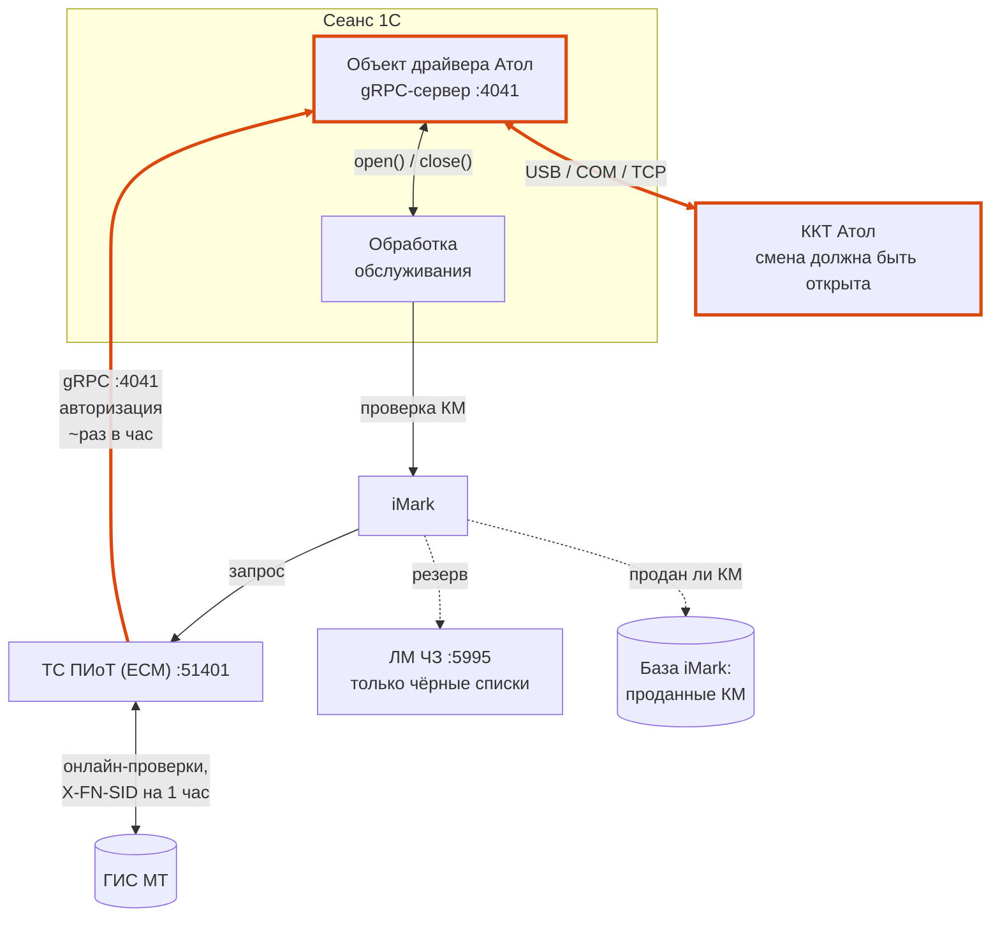
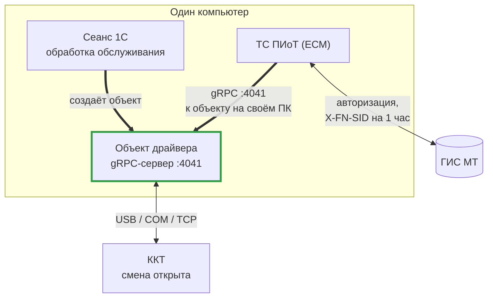
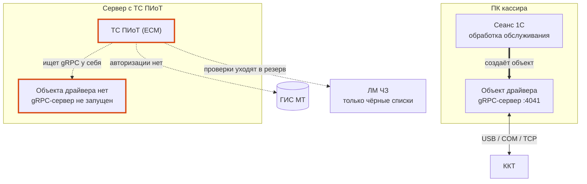

# ТС ПИоТ

## Что такое ТС ПИоТ

**ТС ПИоТ** (технические средства получения информации о товаре) —
программные и программно-аппаратные решения, работающие в связке с
контрольно-кассовой техникой. Это единое сертифицированное средство
взаимодействия кассы с ГИС МТ: кассовое ПО направляет коды маркировки не
напрямую в ГИС МТ (через площадки CDN), а через ТС ПИоТ, которое уже само
обращается в ГИС МТ.

ТС ПИоТ проверяет основные критерии разрешительного режима (ПП РФ 1944):

- отсутствие кода маркировки в системе;
- статус товара (выведен из оборота, заблокирован);
- истечение срока годности;
- корректность криптографической подписи кода.

Помимо проверки кодов, ТС ПИоТ контролирует работоспособность компонентов
кассовой зоны, корректность распознавания кодов маркировки и блокирует
продажу товаров, запрещённых к реализации. Сведения о кассовой зоне
(версия кассового ПО, ОС, модель ККТ, данные о сканере) передаются в
«Честный знак».

### Офлайн-режим

ТС ПИоТ взаимодействует с локальным модулем Честного знака, который содержит список заблокированных кодов
маркировки. При отсутствии связи с интернетом проверка отсканированного кода выполняется по локальной базе, а сведения о продажах накапливаются. При восстановлении связи накопленная информация передаётся в ГИС МТ.

### Обязательность и сроки

Внедрение ТС ПИоТ требуется розничным продавцам маркированных товаров,
подпадающих под разрешительный режим. Прежняя схема передачи данных в ГИС
МТ через токен (X-API-KEY) действует **до 1 июля 2026 года**, после чего
происходит полный переход на ТС ПИоТ, и токен перестаёт работать.
Использование ТС ПИоТ при продаже лекарственных препаратов обязательным
не является.

::: tip Информация
Сроки и перечень товарных групп уточняйте в первоисточнике — ниже
приведены ссылки на материалы «Честного знака».
:::

## Работа через ТС ПИоТ в обработке

Как и обычный разрешительный режим, работа через ТС ПИоТ в обработке
реализуется в связке с программным модулем **«Айтида iMark»** — он
принимает запросы от обработки и маршрутизирует их на ТС ПИоТ. Со стороны
обработки схема проверки кодов маркировки остаётся прежней — отличается
только канал, по которому выполняются запросы, и он определяется
настройками самого iMark.

Общие требования к подготовке (доработка конфигурации, версия обработки,
ФФД 1.2) совпадают с обычным разрешительным режимом — см.
[«Разрешительный режим»](/instructions/permit-mode).

## Настройка режима ТС ПИоТ в модуле iMark

Работа через ТС ПИоТ в связке с iMark задействует несколько компонентов:

- **iMark** — модуль Айтида iMark, через который обработка обращается за
  проверкой кодов маркировки.
- **ЕСМ** — единый сервисный модуль (компании «ЕСП»); в режиме работы с ТС ПИоТ
  iMark направляет запросы в ЕСМ, а не напрямую в ГИС МТ.
- **ЛМ ЧЗ** — локальный модуль «Честный знак»; используется как резервный
  канал проверки.

### Требуемые версии

- Модуль **iMark** — не ниже **2.0.1** (версия загруженных скриптов в
  настройках iMark — не ниже **2.0.1.480**);
- **ЛМ ЧЗ** — не ниже **2.1.0**;
- **ЕСМ** — не ниже **1.6.2**;
- **ДККТ** — с поддержкой работы с ТС ПИоТ (из состава дистрибутива ЕСМ в соответствии с разрядностью используемой платформы 1С).

### Предварительная установка

1. Установить **ЛМ ЧЗ** (скачать с сайта «Честного знака»,
   <https://честныйзнак.рф/local-module/>, установить по их инструкции).
2. Установить **ЕСМ**, **ДККТ** и контроллер ЛМ ЧЗ согласно инструкции
   «ЕСП». После настройки ЕСМ убедиться, что лицензия ЕСМ активна, статус
   блока «ЛМ ЧЗ» — «Готов к работе», статус блока «ГИС МТ» — «Стабильно».

   

   ::: tip Несколько касс на одном ПК
   По умолчанию на кассовый ПК ставится **один** экземпляр ЕСМ и ЛМ ЧЗ.
   Если на одном ПК работают **две кассы** (например, при совмещении
   юридических лиц), потребуется второй экземпляр:
   - [добавление второго экземпляра ККТ в ЕСМ](https://wiki.itida.ru/imark/tspiot-add-kkt);
   - [развёртывание второго ЛМ ЧЗ с контроллером в Docker](https://wiki.itida.ru/imark/lmdocker-controller)
     — вариант в рамках одного ПК (требует соответствия ПК минимальным
     требованиям Docker; иначе второй ЛМ ЧЗ ставят на соседний ПК).
   :::
3. Установить/обновить **iMark** с поддержкой ЕСМ (версия не ниже
   указанной выше).

### Включение режима и настройка организации

1. Запустить клиент iMark (**imarkcln.exe** или веб-интерфейс в браузере) и авторизоваться под
   пользователем с правом настроек (пароль администратора по умолчанию —
   **123**).

2. Включить флаг **«Работа с ТС ПИоТ»**:
   - в десктоп-клиенте — на вкладке **Настройки → Параметры iMark**;
      
   - в веб-интерфейсе — в разделе **Параметры iMark → Работа с ГИС МТ**.
    
3. В карточке организации указать параметры связи (становятся доступны
   после включения режима):
   - **адрес и порт ЕСМ** — по умолчанию `127.0.0.1:51401`;
   - **адрес и порт ЛМ ЧЗ** — по умолчанию `127.0.0.1:5995`.

   Сохранить карточку организации — после этого запросы на проверку КМ
   направляются в ЕСМ.
   
   

### Что меняется при включении режима ТС ПИоТ

- Отключается **прямое взаимодействие с ГИС МТ** и **опрос площадок
  CDN** (раздел CDN и параметр интервала опроса не используются).
- Поле **«Url ГИС МТ»** у организации не задаётся — адрес определяется
  параметрами ЕСМ.
- Если ТС ПИоТ не ответил в пределах таймаута проверок или вернул код
  HTTP из диапазона **514–520**, iMark выполняет резервную проверку через
  **ЛМ ЧЗ**.

Остальные настройки iMark (тип и путь базы данных, журнал, резервное
копирование, локальные проверки по базе проданных КМ, пользователи и
пароли) задаются так же, как и в обычном режиме —
см. [«Разрешительный режим»](/instructions/permit-mode) и руководство
администратора iMark.

## Настройка обработки

Параметры подключения обработки к iMark (IP-адрес, порт, пароль
пользователя) и выбор уровней проверки задаются одинаково для обычного
разрешительного режима и для ТС ПИоТ — со стороны обработки канал ТС ПИоТ
прозрачен и определяется настройками самого iMark.

Порядок настройки описан в разделе
[«Разрешительный режим» → «Подготовка и настройка»](/instructions/permit-mode#подготовка-и-настройка).

Кнопка «Проверка авторизации в iMark» в настройках обработки показывает, включён ли
в iMark режим ТС ПИоТ, а также версию и дату загруженных серверных скриптов.

### Несколько касс одного юридического лица

Адрес ТС ПИоТ в iMark задаётся одной общей настройкой. Если от одного
юридического лица работают несколько касс и у каждой свой экземпляр
ТС ПИоТ, адрес задаётся на стороне обработки — в настройках устройства
на закладке **«Маркировка» → «Прочие настройки»** (с версии 6.0.1):

- **Адрес ТС ПИоТ** — IP-адрес или имя хоста экземпляра ТС ПИоТ этой кассы;
- **Порт ТС ПИоТ** — его порт.

По умолчанию поля пусты. Кнопка выбора в поле подставляет стандартное
значение — `127.0.0.1` для адреса и `51401` для порта.

При заполненных **обоих** полях обработка добавляет в каждую позицию запроса
проверки блок `esm` с этим адресом, и iMark выполняет проверку через него,
а не через адрес из своей общей настройки. Если заполнено только одно поле
или оба пусты, блок не передаётся и действует общая настройка iMark.

::: warning Внимание
Переопределение адреса требует установленной версии iMark 2.0.1.500 и выше, понимающей блок
`esm` в позициях запроса; на более ранних версиях блок игнорируется.
:::

## Режим ТС ПИоТ для касс Штрих

Для касс **Штрих** в обработке предусмотрен отдельный режим работы с
ТС ПИоТ — он переводит ККТ Штрих в режим работы с ТС ПИоТ.

- Флаг **«Включить передачу информации в драйвер ТС ПИоТ (ЕСМ)»** расположен на странице параметров драйвера
  **Штрих** в форме **«Дополнительные настройки подключения»** (доступен,
  когда выбран драйвер Штрих).  
- При включении флага драйвер ККТ переводится в режим работы с ТС ПИоТ до
  применения параметров ЛУ.

## Режим ТС ПИоТ для касс Атол

Для касс **Атол** работа с ТС ПИоТ выполняется через gRPC-сервер драйвера
Атол (ДТО 10). Чтобы он был запущен, необходимо указать **порт gRPC** в
форме **«Дополнительные настройки подключения»** на странице параметров
драйвера **Атол**.

- Поле **Порт сервера gRPC** задаётся на странице параметров драйвера **Атол** в
  форме **«Дополнительные настройки подключения»**. Значение по умолчанию
  — **4041**.
- Указанный порт передаётся драйверу как параметр настроек ККТ
  (gRPC-сервер поднимается только при заполненном значении порта).
- Если порт gRPC не задан, gRPC-сервер драйвера не запускается и проверка
  кодов маркировки через ТС ПИоТ для кассы Атол выполняться не будет.

### Схема подключения и удержание связи с ККТ

ТС ПИоТ обращается к кассе Атол не напрямую, а через gRPC-сервер, который
поднимает **объект драйвера Атол** — тот самый, что обработка создаёт в
сеансе 1С при подключении к ККТ. Сервер работает только пока соединение
этого объекта с кассой открыто. По умолчанию обработка освобождает связь с
ККТ после каждой операции (чтобы кассой могли пользоваться другие
программы), и в паузах между операциями gRPC-сервера просто нет.

Касса нужна ТС ПИоТ не при каждой проверке кода, а при **авторизации в
ГИС МТ**. ГИС МТ выдаёт токен сеанса `X-FN-SID`, который живёт **один час**
с момента успешной аутентификации (таймер `T2_FN_AUTH_s` = 3600 с по
протоколу ТС ПИоТ — ГИС МТ) и уничтожается при разрыве соединения. Всё это
время ТС ПИоТ держит токен в кэше и подставляет его в запросы проверки.
Когда токен протухает, ТС ПИоТ снова идёт в ККТ через gRPC — ФН
подписывает данные, полученные от ГИС МТ, — и получает новый `X-FN-SID`.
То есть соединение с кассой требуется примерно раз в час, но в заранее
неизвестный момент.

Подписывает данные авторизации **фискальный накопитель**, а команды подписи
ФН выполняет только **в открытой смене**. Поэтому открытая смена в ККТ —
такое же обязательное условие работы канала ГИС МТ, как и живое соединение
с кассой: в закрытой смене ККТ ответит ошибкой, и авторизация не пройдёт,
даже если gRPC-сервер доступен.

Сам iMark, помимо запроса в ТС ПИоТ, проверяет код и по **своей базе
проданных КМ** — не продавалась ли марка ранее (если в обработке включена
передача чеков в iMark). Эта проверка от канала ГИС МТ не зависит.

Выделенная цепочка **ТС ПИоТ → gRPC → объект драйвера → ККТ** и есть слабое
звено. Разорвать её могут две разные причины: закрытое соединение с кассой
и закрытая смена в ККТ.

**Соединение с кассой закрыто.** Если «Не отключаться от ККТ» выключено,
цепочка отказа такая:

1. обработка завершила операцию и закрыла соединение — gRPC-сервер
   объекта драйвера остановлен; открыт он только на секунды во время
   пробития чека или проверки КМ;
2. через час ГИС МТ сбрасывает сеанс, ТС ПИоТ идёт в ККТ за новой подписью
   для `X-FN-SID` — а gRPC недоступен: авторизация не проходит, канал
   ГИС МТ не поднимается (в ЕСМ статус блока «ГИС МТ» — не «Стабильно»);
3. iMark не получает онлайн-ответ и уходит в резерв через ЛМ ЧЗ;
4. ЛМ ЧЗ проверяет код только по чёрным спискам — статус товара, срок
   годности и криптоподпись кода **не проверяются**, хотя внешне проверки
   «проходят». Проверка по базе проданных КМ в iMark при этом
   продолжает работать, но остальные критерии остаются без контроля.

**Смена в ККТ закрыта.** Соединение и gRPC-сервер при этом могут быть в
полном порядке: ТС ПИоТ достучится до кассы, но ФН откажется выполнить
команду подписи — в закрытой смене такие операции недоступны. Дальше всё
повторяет пункты 3 и 4: авторизации нет, канал ГИС МТ не поднимается,
проверки уходят на ЛМ ЧЗ. Характерные ситуации:

- проверки марок выполняются **до открытия смены** — например, при приёмке
  или при подборе товара в чек утром, пока смену ещё не открыли;
- смену **закрыли в конце дня**, а работа с марками продолжается;
- смена открыта **дольше 24 часов**: ККТ считает её просроченной и
  отказывает в фискальных операциях, пока смена не будет закрыта.

Типичная картина: сразу после теста связи или первого чека всё работает —
момент авторизации совпал с открытым соединением и открытой сменой, — а
примерно через час проверки незаметно переходят на ЛМ ЧЗ.

Чтобы канал держался, нужны четыре условия:

- флаг **«Не отключаться от ККТ»** включён — форма «Дополнительные
  настройки подключения», см. [раздел 3 руководства по настройкам](/instructions/handler-settings#_3-дополнительные-настройки-подключения).
  Обработка держит соединение с кассой открытым между операциями, и
  gRPC-сервер доступен ТС ПИоТ постоянно;
- **порт сервера gRPC** задан (по умолчанию `4041`) и совпадает с портом
  ККТ в настройках ЕСМ;
- сеанс 1С с подключённой обработкой запущен: объект драйвера живёт
  внутри него, и после закрытия 1С gRPC-сервер исчезает вместе с ним;
- **смена в ККТ открыта** — открывать её в начале рабочего дня, до первых
  проверок кодов маркировки, и не оставлять кассу с закрытой сменой, пока
  идёт работа с марками.

::: warning Внимание
При включённом «Не отключаться от ККТ» касса занята сеансом 1С: другие
программы (утилиты Атол, тест драйвера, вторая база) к ней не подключатся,
пока 1С работает. Это ожидаемое поведение, а не сбой.
:::

### Где должен жить объект драйвера

Касса нужна двоим сразу: кассовому ПО — чтобы пробивать чеки, и ТС ПИоТ —
чтобы раз в час авторизоваться в ГИС МТ. Если бы каждый подключался к ККТ
сам, со своими параметрами связи и своим объектом драйвера, они конфликтовали
бы за доступ к кассе, и работа кассира стала бы невозможной.

Поэтому разработчики драйвера и ТС ПИоТ сделали **параллельный доступ**:
объект драйвера, созданный кассовым ПО, вместе с gRPC-сервисом (он ставится
вместе с драйвером ККТ) образует второй канал к той же кассе. ТС ПИоТ
подключается на порт gRPC и попадает **в тот же самый объект драйвера**,
который обработка создала в сеансе 1С. Своего подключения к ККТ у ТС ПИоТ нет
и не появится.

Отсюда требование, которое легко упустить: на компьютере с ТС ПИоТ должен
быть **создан объект драйвера**. Наша обработка создаёт его в сеансе 1С —
значит сеанс 1С, работающий с кассой, должен быть запущен на том же
компьютере, где установлен ТС ПИоТ.

**Частая ошибка** — поставить ТС ПИоТ на отдельный компьютер (сервер), оставив
1С на кассовом. ЕСМ настроен, порт gRPC указан, касса доступна по сети — но
рядом с ТС ПИоТ никто не создал объект драйвера, а обращаться напрямую к ККТ
он не умеет. Кассу он не обнаружит, авторизацию не пройдёт, канал ГИС МТ не
поднимется — и проверки уйдут на ЛМ ЧЗ, то есть на одни чёрные списки.

Заметить это по симптомам сложно: чеки пробиваются, обработка на кассовом ПК
работает штатно, проверки кодов маркировки внешне проходят. Единственный
надёжный признак — статус блока «ГИС МТ» в ЕСМ: он не станет «Стабильно».

::: tip Когда 1С и ТС ПИоТ всё же можно развести по разным компьютерам
Разнести их можно ровно в одном случае: если на компьютере с ТС ПИоТ объект
драйвера создаёт **кто-то другой** — серверное решение, которое само подключает
ККТ, держит связь и предоставляет кассовому ПО программный интерфейс для
фискализации чеков, открытия и закрытия смены, проверки кодов маркировки.
Тогда 1С объект драйвера не создаёт вовсе, а работает с кассой по этому
интерфейсу; ТС ПИоТ же через gRPC попадает в объект, созданный сервером.
Наша обработка в текущих версиях работает по первой схеме — создаёт объект
драйвера сама, поэтому её сеанс должен быть на одном компьютере с ТС ПИоТ.

Такая схема готовится в самой **Айтида iMark**: сервер будет держать подключение
к ККТ и предоставлять кассовому ПО программный интерфейс, и тогда сеанс 1С сможет
работать отдельно от компьютера с ТС ПИоТ.
:::

## См. также

- [Разрешительный режим](/instructions/permit-mode)
- [Модуль «Маркировка»](/instructions/marking)
- [Исправление марок](/instructions/marking-fix)

### Материалы «Честного знака» о ТС ПИоТ

- [О ТС ПИоТ (честныйзнак.рф)](https://честныйзнак.рф/ts-piot/about/)
- [ТС ПИоТ: что это и что делать участнику оборота (markirovka.ru)](https://markirovka.ru/community/rezhim-proverok-na-kassakh/tekhnicheskie-sredstva-polucheniya-informatsii-o-tovare-ts-piot)
- [ТС ПИоТ — раздел знаний (markirovka.ru)](https://markirovka.ru/knowledge/tovarnye-gruppy/obschie-voprosy-gis/tekhnicheskie-sredstva-polucheniya-informatsii-o-tovare-ts-piot)
